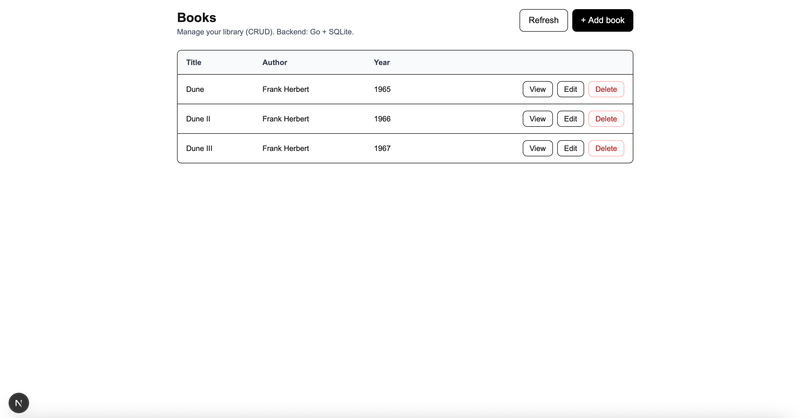
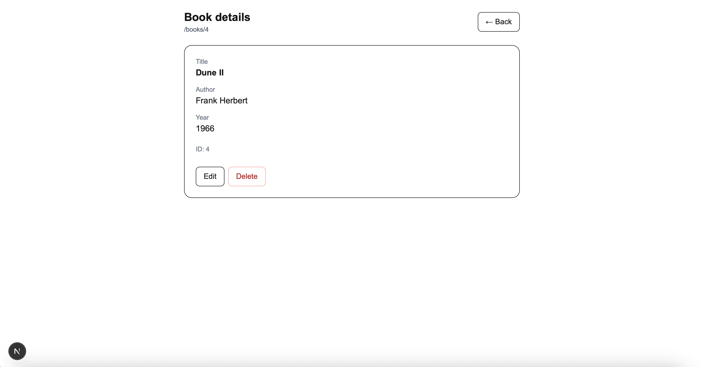
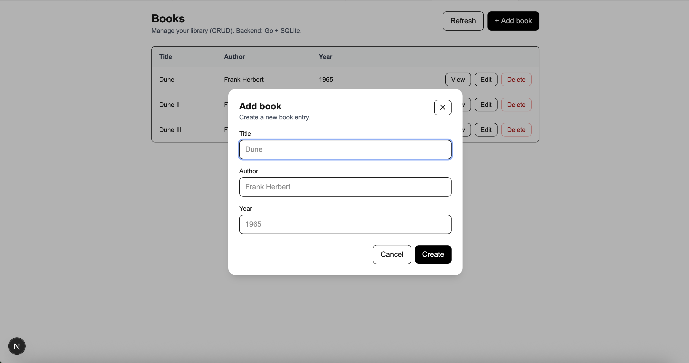

# byFood Assignment – Full Stack CRUD App

This project is a full-stack web application built as part of the byFood assignment.
It implements a RESTful backend API with persistent storage and a frontend dashboard
for managing books.

The application supports full CRUD operations, URL processing, API documentation
via Swagger, and a modern frontend built with Next.js.

---

## Tech Stack

### Backend
- Go
- chi (HTTP router)
- SQLite (persistent storage)
- Swagger (OpenAPI documentation)

### Frontend
- Next.js (App Router)
- React
- TypeScript
- Tailwind CSS
- Context API (global state management)

---

## Features

### Backend
- CRUD API for books
- SQLite persistence
- URL processing endpoint (`/process-url`)
- Input validation and error handling
- Swagger UI for API documentation
- Unit and integration tests

### Frontend
- Dashboard listing all books
- Add / edit / delete books via modal form
- Client-side form validation
- Dynamic routing for book detail pages (`/books/[id]`)
- Global state via Context API
- User-friendly error handling

---

## Backend Setup

```bash
cd backend
go run .


The backend runs on:
http://localhost:8080

Swagger UI
http://localhost:8080/swagger/index.html

Frontend Setup
cd frontend
npm install
npm run dev

## Screenshots

### Dashboard


### Book Detail Page


### Add Book Modal


### Edit Book Modal


### Swagger UI

